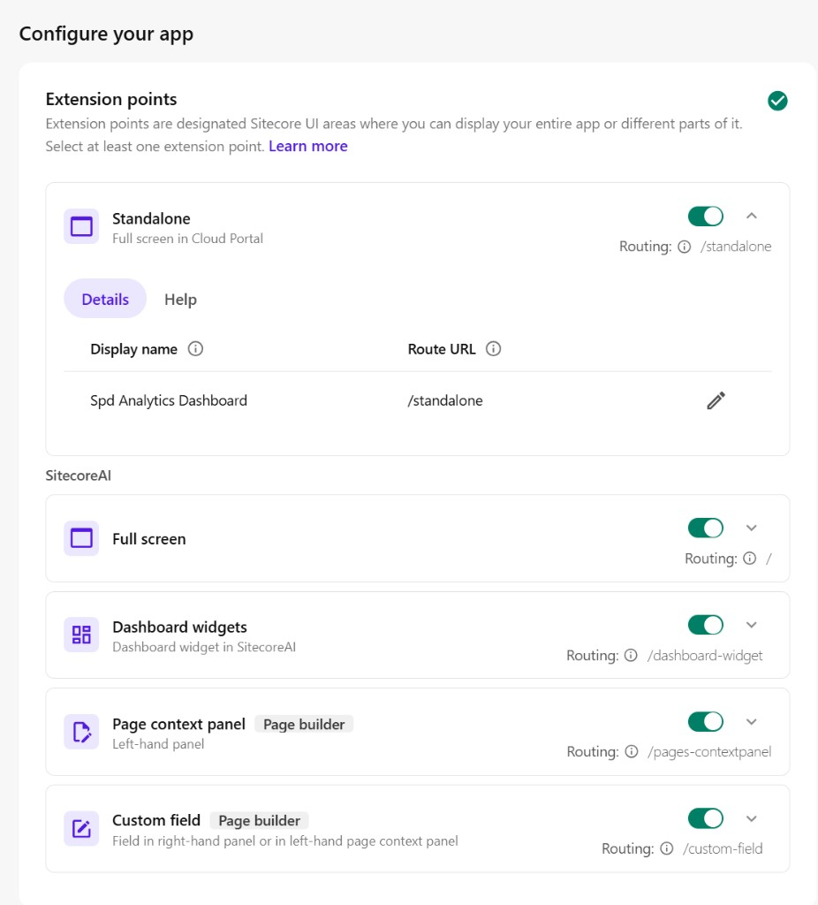
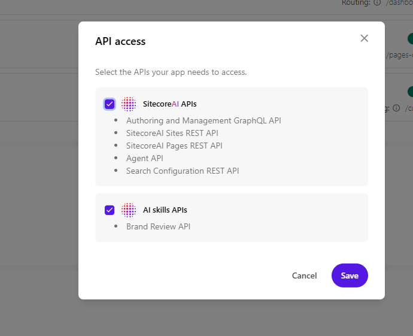

# 05 – Register in XM Cloud

Before your app can appear in the Sitecore Cloud Portal, you must register it in **Developer Studio**. This guide walks through each step and explains common mistakes.

---

## Step 1: Open Developer Studio

1. Log in to the [Sitecore Cloud Portal](https://portal.sitecorecloud.io/)
2. Go to **Developer Studio** (usually in the main navigation or under your org)
3. Click **Create** → **Custom App**

---

## Step 2: Basic info

- **Name:** e.g. "SPD Marketplace App"
- **Description:** Short description of what the app does (optional but helpful)

---

## Step 3: Deployment URL

**Critical:** Use the **base URL only**. For local development:

```
http://localhost:3000
```

Do **not** include:
- `/standalone`
- `/pages-contextpanel`
- Any path

Sitecore appends the extension route automatically. For example, when loading the Standalone extension, it requests `http://localhost:3000/standalone`. If you set the Deployment URL to `http://localhost:3000/standalone`, Sitecore would request `http://localhost:3000/standalone/standalone` for Standalone and `http://localhost:3000/standalone/pages-contextpanel` for the Pages Context Panel—both would 404.

For production, use your deployed app URL (e.g. `https://your-app.vercel.app`). Vercel deployment is supported and tested – see [Deploy to Vercel](./README.md#deploy-to-vercel-production) in the docs index.

---

## Step 4: Extension points

Enable each extension and set its **Routing** value:

| Extension | Enable | Routing |
|-----------|--------|---------|
| Standalone | ✓ | `/standalone` |
| Page context panel | ✓ | `/pages-contextpanel` |
| Dashboard widgets | ✓ | `/dashboard-widget` |
| Custom field | ✓ | `/custom-field` |

The Routing value is the path in your Next.js app. Each `app/<folder>/page.tsx` corresponds to a route (e.g. `app/standalone/page.tsx` → `/standalone`).



---

## Step 5: API Access

Click **Select APIs** and enable:

- **Authoring and Management GraphQL API** – Required for the **Pages Context Panel** (content stats and Word import use server-side OAuth2, but the app still needs this for SDK operations).
- **Content/Preview API** – Only needed if you use the **Standalone** dashboard extension. The Pages Context Panel uses `/api/content-stats` (Authoring API) and does **not** require Preview API.



**Tip for junior devs:** Start with just **Authoring and Management GraphQL API**. Use the Pages Context Panel from the Pages editor – it shows Total Items and Word import without needing Preview API access.

---

## Step 6: Save, Activate, and Install

1. **Save** the app configuration
2. **Activate** the app (if it's in draft)
3. Go to **My Apps** and **Install** the app for your organization

After installation, the app appears in the Portal navigation and in the Pages editor (for the Context Panel and Custom Field).

---

## Troubleshooting

### 404 for /standalone/pages-contextpanel

**Cause:** Deployment URL includes a path (e.g. `http://localhost:3000/standalone`).

**Fix:** Set Deployment URL to `http://localhost:3000` (base only).

---

### Total Items = 0

**Cause:** Either (a) API Access is not enabled, or (b) you're using Standalone from the Portal, which often lacks site context (`sitecoreContextId`).

**Fix:**
1. Enable **Authoring and Management GraphQL API** in API Access
2. Use the **Pages Context Panel** from the Pages editor (open a page, then open the context panel) for site-specific data

---

### Blank screen or SDK error

**Cause:** App opened directly at `http://localhost:3000/standalone` instead of from the Portal.

**Fix:** Open the app from the Cloud Portal. The SDK requires the iframe context and `window.parent` communication.

---

### App not in navigation

**Cause:** App not activated or not installed.

**Fix:** In Developer Studio, ensure the app is **Active**. In the Portal, go to **My Apps** and **Install** the app.

---

## Next steps

- [06 – Project Structure](./06-project-structure.md) – Code layout and key files
- [Back to index](./README.md)
