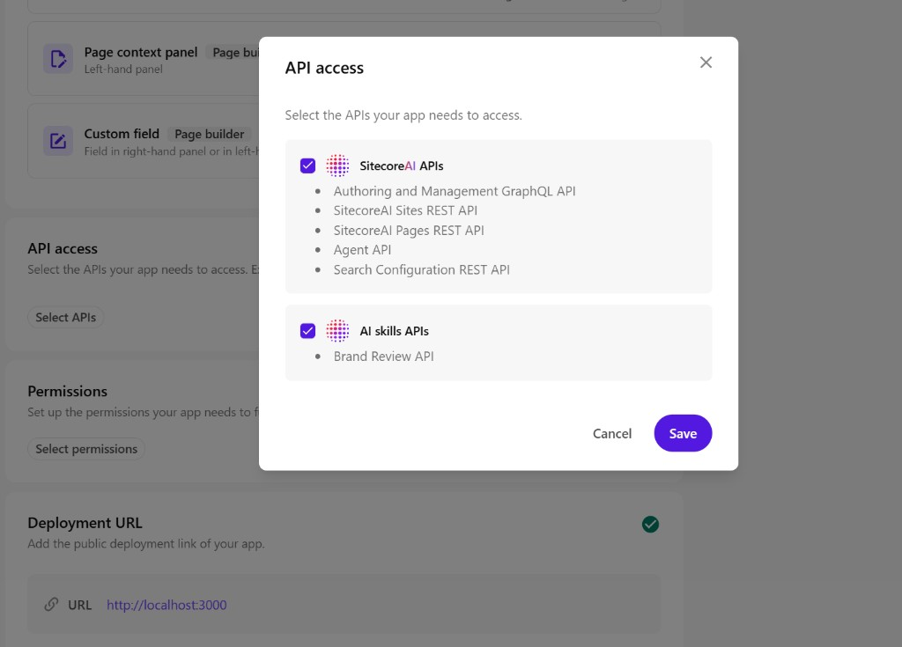

# SPD Marketplace App – Documentation

This documentation is written for **junior developers** new to Sitecore Marketplace apps. Each section includes detailed explanations, step-by-step instructions, and links to official resources.

---

## Quick Start

```bash
npm install
npm run dev
```

Then [register the app](#register-in-xm-cloud) in Developer Studio. **Important:** Do not open `http://localhost:3000` directly in your browser. The app must run inside the Sitecore Cloud Portal in an iframe—opening it standalone will cause the SDK to fail and you'll see a blank or error screen.

---

## Prerequisites

- **Node.js 16+** and **npm 10+** – [Download from nodejs.org](https://nodejs.org/)
- **Sitecore Cloud Portal** access with Org Admin or Owner role – [portal.sitecorecloud.io](https://portal.sitecorecloud.io/)
- Basic familiarity with React and Next.js (components, hooks, `useEffect`)

---

## Register in XM Cloud

Before the app can appear in the Portal, you must register it in **Developer Studio**:

1. Go to **Developer Studio** → **Create** → **Custom App**
2. **Basic info:** Enter a name (e.g. "SPD Marketplace App") and description
3. **Deployment URL:** Use `http://localhost:3000` — the **base URL only**. Do not include `/standalone` or any path. Sitecore appends the extension route automatically (e.g. `/standalone`, `/pages-contextpanel`).
4. **Extension points:** Enable each extension and set the **Routing** value:
   - **Standalone:** `/standalone`
   - **Page context panel:** `/pages-contextpanel` (required for site-specific content data)
   - **Dashboard widgets:** `/dashboard-widget`
   - **Custom field:** `/custom-field`
5. **API Access:** Click **Select APIs** → enable **Content/Preview API** (for content analytics) and **Authoring and Management GraphQL API**. The Word import uses a server-side OAuth2 Automation client (see [08 – Word Import](./08-word-import.md)), but the content analytics needs Preview API access.
6. **Save** → **Activate** → **Install** from My Apps




---

## Project Structure

| Path | Purpose |
|------|---------|
| `app/standalone/` | Full-page analytics dashboard (runs from Portal navigation) |
| `app/pages-contextpanel/` | Site-specific analytics + Word import (runs inside Pages editor) |
| `app/import-doc/` | Standalone Word document import page (optional) |
| `app/dashboard-widget/` | Compact dashboard card widget |
| `app/custom-field/` | Color picker custom field (`getValue` / `setValue`) |
| `components/ArticleUploader.tsx` | Word document upload → ArticlePage creation |
| `hooks/useMarketplaceClient.ts` | SDK initialization hook (singleton) |
| `lib/xmcClient.ts` | GraphQL helpers (`executeGraphQL`, `searchByContentRoot`) |
| `lib/document-processor.ts` | Word OOXML parsing |
| `lib/article-document-processor.ts` | Extracts title, date, content, author |
| `lib/sitecore-constants.ts` | Template IDs, item paths, field names |

---

## Authentication approach

The app uses two authentication mechanisms:

| Feature | Auth method | Where credentials come from |
|---------|-------------|-----------------------------|
| **Content analytics** (Total Items, etc.) | Server-side OAuth2 | Same as Word import – uses `/api/content-stats` |
| **Word document import** | Server-side OAuth2 | XM Cloud Deploy → Credentials → Automation client |
| **Dashboard, custom field** | Marketplace SDK (session-based) | User's Portal session – no config needed |

Both the content analytics and Word import use **server-side API routes** that call the Sitecore Authoring GraphQL API with OAuth2. No Content/Preview API access in Developer Studio is required. See [08 – Word Import](./08-word-import.md) for credentials setup.

---

## Troubleshooting

| Issue | Fix |
|-------|-----|
| **Total Items = 0** | Use the **Pages Context Panel** from the Pages editor (not standalone from Portal). Enable **API Access** (Authoring and Management GraphQL API) in Developer Studio. |
| **404 for /standalone/pages-contextpanel** | Deployment URL must be `http://localhost:3000`, not `http://localhost:3000/standalone`. Sitecore appends the route. |
| **SDK fails / blank screen** | Open the app from the Cloud Portal, not by visiting localhost directly. Ensure the dev server is running. |
| **App not in navigation** | Confirm the app is **Active** and **Installed** from My Apps in the Portal. |

---

## Step-by-Step Guides

For a deeper walkthrough, follow these guides in order:

- [01 – Getting Started](./01-getting-started.md) – Prerequisites, what the app does, and why it runs in an iframe
- [02 – Create Project](./02-create-project.md) – Scaffolding the Next.js app and installing the SDK
- [03 – SDK Setup](./03-sdk-setup.md) – Initializing the Marketplace SDK and using the client
- [04 – Extension Points](./04-extension-points.md) – Standalone, Pages Context Panel, Dashboard Widget, Custom Field
- [05 – Register App](./05-register-app.md) – Registering and configuring the app in Developer Studio
- [06 – Project Structure](./06-project-structure.md) – Code layout and key files
- [07 – Zero Data](./07-troubleshooting-zero-data.md) – Why Total Items = 0 and how to fix it
- [08 – Word Import](./08-word-import.md) – Import Word documents and create articles in Sitecore

---

## External Links

- [Sitecore Marketplace SDK for JavaScript](https://doc.sitecore.com/mp/en/developers/sdk/latest/sitecore-marketplace-sdk/sitecore-marketplace-sdk-for-javascript.html) – Official SDK docs
- [Marketplace SDK Quick Start (Manual)](https://doc.sitecore.com/mp/en/developers/sdk/latest/sitecore-marketplace-sdk/quick-start--manual-.html) – Manual initialization
- [Marketplace Starter Kit](https://github.com/Sitecore/marketplace-starter) – Preconfigured Next.js starter
- [XM Cloud Developer Docs](https://doc.sitecore.com/ch/en/developers/latest/cloud-dev/get-started-1523436.html) – XM Cloud overview
- [FMC-ORG/xmc-marketplace](https://github.com/FMC-ORG/xmc-marketplace) – Word import reference implementation
